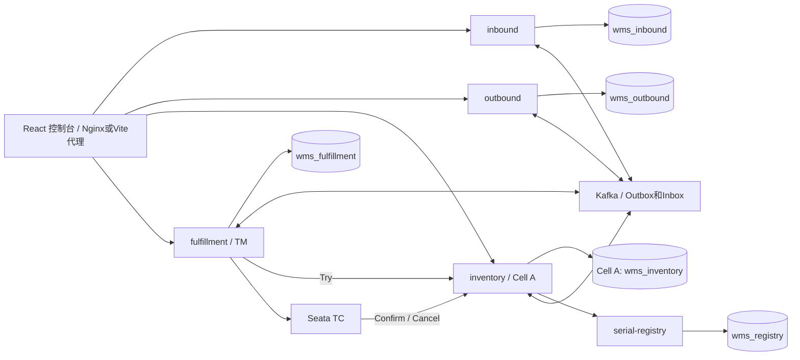
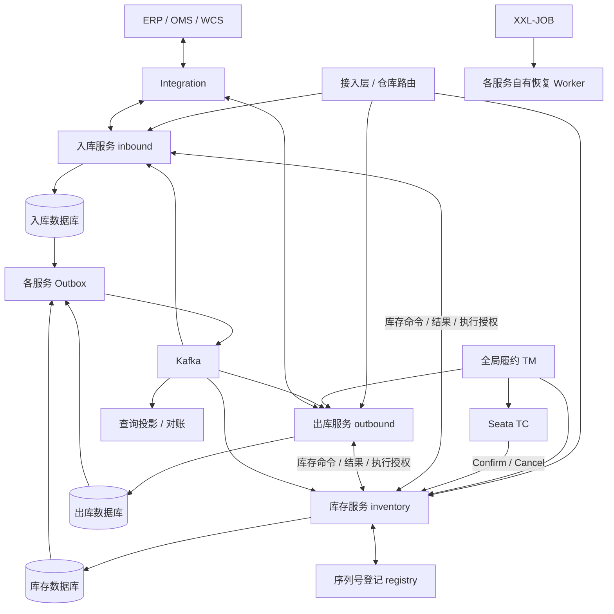

# 总体架构与实现边界

核对基线：`main c5c96e3`（2026-09-13）。本文件同时保留业务目标与当前实现，两者在下面分别标识。版本以[版本记录](../implementation/VERSION_LOCK.md)为准，配置入口见[连接清单](../operations/INFRASTRUCTURE.md)。

## 当前实现快照



当前有五个后端可执行应用和一个前端。图中业务消息、序列号客户端、原生 RM、TC 审计及自动执行都需要显式配置，Compose 默认关闭这些执行开关。应用库在隔离开发环境共享 mysql-apps 实例但使用不同 schema/账号；inventory 连接独立 Cell A 数据库。Cell B 数据库已编排，第二个库存应用需另行配置。图不表示默认启动后所有业务链路已启用。

`wms-integration` 当前是出库依赖的 WCS 端口与模拟适配库；查询投影位于 inventory 内。独立 integration/query 服务是演进目标。真实外部设备、生产高可用与容量尚未验收。

## 1. 目标与边界

交付可追溯、库存不为负、支持多仓协同的自营 WMS。负责实物收发存、作业执行及仓内库存权威；OMS 负责销售订单，ERP 负责采购与财务，TMS 负责运输，WCS 负责设备动作。WMS 不成为销售承诺、财务金额或运输轨迹的隐式第二权威。

全局履约协调是独立业务边界。S0 已确认唯一 TM 为 `wms-fulfillment`（无现有 OMS 协调器）。全局事务决定始终由 Seata TC 持有；不得同时运行两个权威协调器。将来若 OMS 具备合格履约能力，通过同一 TCC 契约交接，不并行第二套 TM。

## 2. 目标逻辑视图



图中展示一个Cell内的三服务结构；Cell A/B重复部署并按仓路由。Cell是资源与故障隔离范围，不是单个应用。三个服务各自扩容、发布和管理数据源，不能共享业务表来伪装独立服务。

## 3. 数据权威与部署边界

| 单元 | 拥有的数据/行为 | 不负责 | 当前实现 / 目标 |
| --- | --- | --- | --- |
| wms-inbound | 入库单、实收事实、质检、上架任务、库存同步状态 | 库存余额及流水 | 每Cell独立进程/库/账号 |
| wms-outbound | 出库单、拣发任务、包裹、实物交接、取消流程 | 库存余额及流水 | 每Cell独立进程/库/账号 |
| wms-inventory | 余额、流水、预占、门禁、执行资格、库存凭证、盘点调整、主数据 | 入库/出库单据与设备派工 | 每Cell独立进程/库/账号 |
| wms-fulfillment | 全局履约TM、XID映射/结果观察、调拨额度 | 直接写各仓库存/入出库表 | 独立服务及数据库 |
| Seata Server | 跨仓TCC全局/分支会话与恢复决定 | 实物流程、库存业务规则 | 隔离 Seata 2.6.0 已验证；生产高可用待验收 |
| wms-serial-registry | 序列号身份、归属授权、转移版本 | 仓内数量与单据 | 独立服务及数据库 |
| wms-integration | 外部协议、设备命令、OMS/ERP/recon适配 | 直接确认库存过账 | 当前为 WCS 适配库；独立服务/库是目标 |
| 查询投影 | 可重建查询投影、导出 | 库存最终判断 | 当前在 inventory 内；未创建 wms-query |
| Worker/Outbox角色 | 所属服务的任务/事件恢复 | 跨服务直接写库 | 使用所属服务代码及权限，可独立部署 |

基础主数据由inventory内masterdata模块管理，inbound/outbound保留版本化快照；质检结论由inbound持有、库存资格由inventory接收并校验。各服务版本/状态分别建模，无共享事务管理器。服务间只共享契约，不共享Mapper、领域实体或业务实现。

## 4. 当前模块组织

```text
wms-platform/
  pom.xml
  wms-contract/                   版本化DTO与事件schema，不包含共享领域实体
  wms-runtime/                    数据库时间、连接池、健康、消息等运行支持
  wms-security/                   OIDC、操作scope及仓权限
  wms-inbound/                    单据/收货/质检/上架/来源命令与恢复
  wms-outbound/                   单据/拣货/包装/发运/取消与恢复
  wms-inventory/                  余额/流水/预占/执行授权/凭证/门禁
    masterdata/ counting/ movement/ inventory/
  wms-fulfillment/                跨仓协调、调拨总单与额度
  wms-serial-registry/            序列号身份与授权
  wms-integration/                WCS端口与模拟适配库
  wms-test-support/               三库/双Cell/故障验证
  wms-console/                   React/Vite/Ant Design作业台（独立npm构建）
  deploy/
  docs/
```

Maven reactor 共 10 个模块。inventory POM 对其他业务模块的依赖用于测试装配，不表示生产可直接调用其他服务的业务实现。

各服务内部按业务能力组织domain/application/infrastructure/api。SQL只在所属服务Mapper；应用服务只组织本服务事务。跨服务调用发生在本地提交之后，通过持久化协调恢复，禁止带数据库事务等待远程执行。简单CRUD不机械增加空接口。

## 5. 技术栈决策

| 能力 | 选型 | 约束 |
| --- | --- | --- |
| 运行时 | Java 21 LTS、Maven Wrapper | 与工作区 Java 21 习惯一致；具体发行版由构建锁定 |
| 框架 | Spring Boot 4.1.1 | POM 已固定；以当前 CI 覆盖范围为证据，不代表生产验收 |
| 持久化 | MySQL 8.4 / InnoDB、MyBatis、Flyway | 当前隔离栈复用既有镜像版本，不连接共享实例；正式数据持久化 |
| 分片 | ShardingSphere-JDBC 5.5.3 | 已验证路由、真实SQL和Fence组合；资源迁移仍有门禁 |
| 跨仓预占事务 | Seata TCC 2.6.0 | 仅库存资源预留；禁用AT自动代理，不启用XA；真实TM/RM已阶段验证 |
| 调度 | XXL-JOB 3.4.2 | admin/executor 版本对齐；仅 BEAN handler；生产不开放任意脚本执行 |
| 事件 | Kafka | 多投影订阅、重放、对账事实流；首期不同时引入 RabbitMQ |
| 缓存 | Redis | 有界查询/资料缓存；不持有库存最终写权限 |
| 附件 | S3 兼容存储（目标） | 当前 Compose 未部署 MinIO；附件授权/保留另行设计 |
| 可观测 | OpenTelemetry / Prometheus / Grafana（目标） | 当前已有运行指标/健康支持，观测后端未在本 Compose 部署 |
| 配置与发现 | 环境配置、部署平台 DNS 为首期方案 | 存量 Nacos 不是强制依赖；如引入须锁兼容矩阵和配置权威 |

当前 Compose 声明 Kafka 3.8.0、Redis 7-alpine 等隔离开发标签；应用依赖、镜像与前端锁文件分开记录，不把浮动标签或历史本机摘要当作生产锁。SBOM/许可证/OSV 有日期的证据见[版本记录](../implementation/VERSION_LOCK.md)，原始选型依据保留于[决策记录](07-decisions-evidence.md)。新增或升级组件需要按实际差异重新验证兼容性，本次文档没有改变选型。

## 6. 请求与事件路径

在线库存写入：认证 → 仓权限 → 路由版本 → inventory本地事务（门禁/数量/预占/执行资格/凭证/流水/Outbox）→ 提交。入出库操作另有来源事务与回执事务，返回physicalStatus和stockSyncStatus，详见[跨服务协议](08-service-boundaries-protocols.md)。

跨仓请求：业务幂等/attempt → TM开启Seata全局事务并保存XID → 各仓Try → TC驱动Confirm/Cancel → 核验TC全局成功及全部仓CONFIRMED → 本地Outbox下达执行授权。详见[Seata TCC](09-seata-tcc.md)。HTTP 超时返回未知/处理中，不转写业务失败。

异步投影：提交的 Outbox → Kafka → 消费去重与投影同事务 → 提交位点。读取投影显示 asOf/lag；写入接口重新校验权威库。

依赖故障的默认策略：库存库不可用拒绝新库存授权，入出库保留可安全受理的观察/处理中状态；登记服务不可用时序列号收货进入待确认隔离；Kafka 故障允许在 Outbox 容量预算内积压，超过阈值按业务限流；查询投影故障不触发无界跨分片回源。

## 7. 可维护性与演进

用户已确认第一版独立部署入库、出库、库存服务。库存本地事务保护库存内部不变量，单据与库存通过持久化命令、回执、执行授权、取消墓碑及补偿收敛；接受短时状态差异和未知实物结果阻塞。后续扩展以这三个既定边界为基础。

跨 Cell 只通过接口和事件协作，不开放跨服务业务表写权限。全网报表由投影和离线汇总服务；核心事务 SQL 不使用跨全国分片聚合。序列号登记与全局协调也按自身稳定业务键扩展，不共用一个无边界“全局库”。
