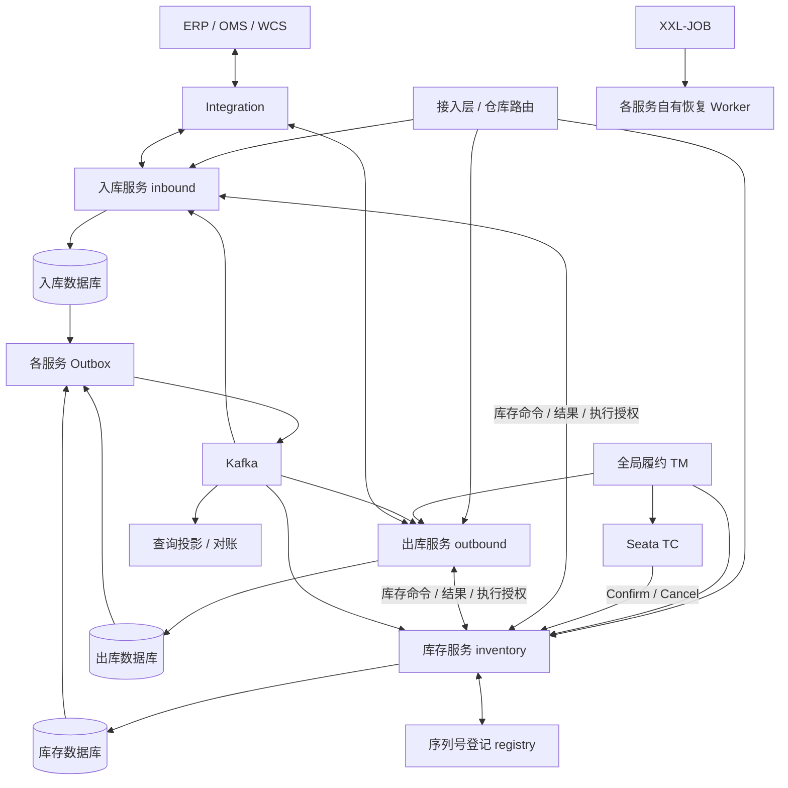

# 总体架构详细设计

## 1. 目标与边界

交付可追溯、库存不为负、支持多仓协同的自营 WMS。负责实物收发存、作业执行及仓内库存权威；OMS 负责销售订单，ERP 负责采购与财务，TMS 负责运输，WCS 负责设备动作。WMS 不成为销售承诺、财务金额或运输轨迹的隐式第二权威。

全局履约协调是独立业务边界。S0 已确认唯一 TM 为 `wms-fulfillment`（无现有 OMS 协调器）。全局事务决定始终由 Seata TC 持有；不得同时运行两个权威协调器。将来若 OMS 具备合格履约能力，通过同一 TCC 契约交接，不并行第二套 TM。

## 2. 逻辑与物理视图



图中展示一个Cell内的三服务结构；Cell A/B重复部署并按仓路由。Cell是资源与故障隔离范围，不是单个应用。三个服务各自扩容、发布和管理数据源，不能共享业务表来伪装独立服务。

## 3. 部署单元与数据权威

| 单元 | 拥有的数据/行为 | 不负责 | 初期部署 |
| --- | --- | --- | --- |
| wms-inbound | 入库单、实收事实、质检、上架任务、库存同步状态 | 库存余额及流水 | 每Cell独立进程/库/账号 |
| wms-outbound | 出库单、拣发任务、包裹、实物交接、取消流程 | 库存余额及流水 | 每Cell独立进程/库/账号 |
| wms-inventory | 余额、流水、预占、门禁、执行资格、库存凭证、盘点调整、主数据 | 入库/出库单据与设备派工 | 每Cell独立进程/库/账号 |
| wms-fulfillment | 全局履约TM、XID映射/结果观察、调拨额度 | 直接写各仓库存/入出库表 | 独立服务及数据库 |
| Seata Server | 跨仓TCC全局/分支会话与恢复决定 | 实物流程、库存业务规则 | 独立高可用基础设施，版本待POC |
| wms-serial-registry | 序列号身份、归属授权、转移版本 | 仓内数量与单据 | 独立服务及数据库 |
| wms-integration | 外部协议、设备命令、OMS/ERP/recon适配 | 直接确认库存过账 | 独立服务及数据库 |
| wms-query | 可重建查询投影、导出 | 库存最终判断 | 独立服务及数据库 |
| Worker/Outbox角色 | 所属服务的任务/事件恢复 | 跨服务直接写库 | 使用所属服务代码及权限，可独立部署 |

基础主数据由inventory内masterdata模块管理，inbound/outbound保留版本化快照；质检结论由inbound持有、库存资格由inventory接收并校验。各服务版本/状态分别建模，无共享事务管理器。服务间只共享契约，不共享Mapper、领域实体或业务实现。

## 4. 模块组织（预期，当前未生成）

```text
wms-platform/
  pom.xml
  wms-contract/                   版本化DTO与事件schema，不包含共享领域实体
  wms-inbound/                    单据/收货/质检/上架/来源命令与恢复
  wms-outbound/                   单据/拣货/包装/发运/取消与恢复
  wms-inventory/                  余额/流水/预占/执行授权/凭证/门禁
    masterdata/ counting/ movement/ inventory/
  wms-fulfillment/                跨仓协调、调拨总单与额度
  wms-serial-registry/            序列号身份与授权
  wms-integration/                OMS/ERP/WCS/recon适配
  wms-query/                      查询投影
  wms-test-support/               三库/双Cell/故障验证
  wms-console/                   Cursor实现
  deploy/
  docs/
```

各服务内部按业务能力组织domain/application/infrastructure/api。SQL只在所属服务Mapper；应用服务只组织本服务事务。跨服务调用发生在本地提交之后，通过持久化协调恢复，禁止带数据库事务等待远程执行。简单CRUD不机械增加空接口。

## 5. 技术栈决策

| 能力 | 选型 | 约束 |
| --- | --- | --- |
| 运行时 | Java 21 LTS、Maven Wrapper | 与工作区 Java 21 习惯一致；具体发行版由构建锁定 |
| 框架 | Spring Boot 4.1.x 为新项目验证候选 | 当前官方文档存在 4.1.1；不代表与全部组件已验证兼容，S0 锁补丁版 |
| 持久化 | MySQL 8.4 / InnoDB、MyBatis、Flyway | 复用 dev-infra 开发实例；正式数据不得纯内存存储 |
| 分片 | ShardingSphere-JDBC 5.5.3 验证候选 | 先验证 SQL/JDBC/Boot/驱动组合；不使用过时 starter 示例直接装配 |
| 跨仓预占事务 | Seata TCC | 仅库存资源预留；禁用AT自动代理，不启用XA；精确版本由S0验证 |
| 调度 | XXL-JOB 3.4.2 验证候选 | admin/executor 版本对齐；仅 BEAN handler；生产不开放任意脚本执行 |
| 事件 | Kafka | 多投影订阅、重放、对账事实流；首期不同时引入 RabbitMQ |
| 缓存 | Redis | 有界查询/资料缓存；不持有库存最终写权限 |
| 附件 | S3 兼容存储，开发复用 MinIO | 附件权限、签名 URL、保留策略单独管理 |
| 可观测 | OpenTelemetry / Prometheus / Grafana | 尽量复用现有 dev-infra 观测栈 |
| 配置与发现 | 环境配置、部署平台 DNS 为首期方案 | 存量 Nacos 不是强制依赖；如引入须锁兼容矩阵和配置权威 |

开发现有 Kafka 3.8.0、Redis 7、MinIO 是本地目录事实，不作生产维护状态背书。所有版本和许可证、漏洞、镜像摘要由 S0 验证并锁定，见 [来源与门禁](07-decisions-evidence.md)。Spring Boot 候选组合若失败，提交替代组合 ADR 后再实施，不静默升级既有项目。

## 6. 请求与事件路径

在线库存写入：认证 → 仓权限 → 路由版本 → inventory本地事务（门禁/数量/预占/执行资格/凭证/流水/Outbox）→ 提交。入出库操作另有来源事务与回执事务，返回physicalStatus和stockSyncStatus，详见[跨服务协议](08-service-boundaries-protocols.md)。

跨仓请求：业务幂等/attempt → TM开启Seata全局事务并保存XID → 各仓Try → TC驱动Confirm/Cancel → 核验TC全局成功及全部仓CONFIRMED → 本地Outbox下达执行授权。详见[Seata TCC](09-seata-tcc.md)。HTTP 超时返回未知/处理中，不转写业务失败。

异步投影：提交的 Outbox → Kafka → 消费去重与投影同事务 → 提交位点。读取投影显示 asOf/lag；写入接口重新校验权威库。

依赖故障的默认策略：库存库不可用拒绝新库存授权，入出库保留可安全受理的观察/处理中状态；登记服务不可用时序列号收货进入待确认隔离；Kafka 故障允许在 Outbox 容量预算内积压，超过阈值按业务限流；查询投影故障不触发无界跨分片回源。

## 7. 可维护性与演进

用户已确认第一版独立部署入库、出库、库存服务。库存本地事务保护库存内部不变量，单据与库存通过持久化命令、回执、执行授权、取消墓碑及补偿收敛；接受短时状态差异和未知实物结果阻塞。后续扩展以这三个既定边界为基础。

跨 Cell 只通过接口和事件协作，不开放跨服务业务表写权限。全网报表由投影和离线汇总服务；核心事务 SQL 不使用跨全国分片聚合。序列号登记与全局协调也按自身稳定业务键扩展，不共用一个无边界“全局库”。
