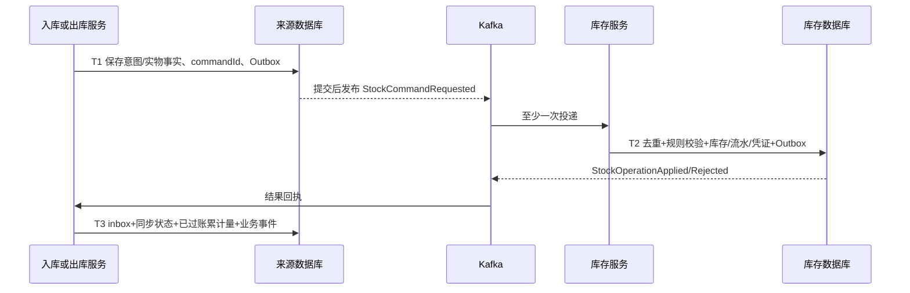

# v0.3 第一版独立入库、出库、库存服务方案

## 1. 已确定的调整

用户明确要求第一版即建立独立服务边界。本版将入库、出库、库存设为三个独立进程、独立数据库/账号、独立发布和扩容的服务。一个Maven仓库可以管理多个服务，不共享业务表、领域实体或跨库事务。本文为拆分协议专项设计，总体架构、数据字典和唯一实施计划已同步；不是额外的一份实施计划。

本次仅出方案和同步文档，不生成业务代码。既有自营仓、非负库存、批次/序列号/效期、跨仓、XXL-JOB、ShardingSphere-JDBC等约束保留。

## 2. 三服务边界

| 服务 | 唯一拥有的数据 | 主要接口/事件 | 本地原子范围 |
| --- | --- | --- | --- |
| wms-inbound | 入库单/行、实收观察、质检结论、上架任务、入库执行事实与库存同步进度 | receipts、quality、putaways；StockCommandRequested、ReceiptConfirmed | 单据数量校验、来源执行事实/意图、来源幂等、Outbox |
| wms-outbound | 出库单/行、波次与拣发任务、包裹、实物交接事实、取消流程与库存同步进度 | picks、packings、shipments；StockCommandRequested、ShipmentConfirmed | 任务领取/执行、来源单据变化、来源幂等、Outbox |
| wms-inventory | 库存余额/流水、预占、库位门禁、库存操作凭证、执行授权/数量占用、本地serial、盘点/库内移位与调整 | reservations、stock-operations、execution-permits、gates；StockOperationApplied/Rejected/Cancelled | 余额、流水、预占、执行占用、库存凭证、库存幂等、Outbox |

库存服务的stock_posting是“库存已发生某项效果”的凭证，不是入库/出库单据副本。入/出库服务保留库存回执的只读映射，不能用自身缓存维护第二套余额。

仓库/库位/商品主数据首期由inventory的masterdata模块拥有，其他服务保存带版本快照。业务创建可先校验快照；最终库存命令必须校验权威规则。调拨总单由fulfillment的transfer模块持有，源仓作业由outbound、目的仓由inbound执行。盘点/移库暂为inventory内模块，不因此增加第四个仓内执行服务。

## 3. Cell 与分片

每个Cell至少有inbound、outbound、inventory三个部署单元，分别连接 `wms_inbound_<cell>`、`wms_outbound_<cell>`、`wms_inventory_<cell>`。开发可复用一个MySQL实例的三个独立schema/账号，集成验证必须通过权限证明不能跨写；生产故障隔离按各库资源预算设计。

ShardingSphere-JDBC只管理所属服务的数据源。同仓库存余额、流水、预占、stock_posting、execution_permit和库存Outbox必须路由到inventory的同一物理事务资源；**入库单和出库单不属于该事务**。其他两个服务也按仓路由，但它们的提交时间与库存提交可以不同。

仓迁移是三服务和库存门禁的协同维护：先停止来源新派工并排空所有已授权物理动作/未闭环库存命令，再迁移各自库、检查各自watermark并切换路由向量。源服务和库存服务都拒绝旧路由epoch。单库迁移成功不等于整仓可以开工。

## 4. 两类操作与两个事实

每个动作区分 `physicalStatus`（实物事实）和 `stockSyncStatus`（库存过账进度）。例如货已发出但库存回执未返回，展示 `physicalStatus=EXECUTED, stockSyncStatus=PENDING`，不能提示重新发货。

- 纯账务/库存动作：预占、释放、资格更新，直接由inventory事务处理。
- 实物动作：收货、上架、拣货、发运。来源服务先持久化动作意图和执行资格，再派发设备/人工任务；执行事实落来源库后提交库存命令，最终按库存结果收敛单据。

收货实物可能先于系统登记到达，先保存观察/待验意向；没有库存入账确认不得继续上架/分配。上架/拣货/发运必须在实物动作前取得库存执行授权。包装绑定在outbound本库完成，每个serial只能关联一个有效包裹，发运清单冻结后不能修改。

## 5. 库存命令协议

命令身份 `commandId` 由来源服务确定并持久化，一次授权执行尝试一个ID；同一业务效果由稳定businessEffectKey关联各历史尝试；来源请求 `clientOperationId`、来源 `operationId`、库存 `inventoryOperationId` 各自独立，以commandId关联。重试不能生成新commandId。幂等唯一键为企业+仓+sourceService+commandId，同键异payloadDigest返回409。payloadDigest是授权意图摘要，结案事实另有settlementDigest；不得把实际量7与授权上限10混作同一个摘要冲突。

命令字段：sourceService、sourceDocumentId、sourceLineId、sourceExecutionId、sourceVersion、action、warehouseId、commandId、businessEffectKey、payloadDigest、quantity/unit、lot/serial、reservationRef、permitRef、causationId、routeEpoch、authorizationRef。businessEffectKey按[幂等专项](10-idempotency-protocols.md)的动作事实规则生成；source_effect/stock_effect唯一，command按效果+attemptNo唯一，posting按效果唯一，防换客户端键重复执行，又允许安全关闭后的新授权尝试。

来源记录固定请求摘要和领域允许的动作；inventory不远程锁单据，也不信任随意传入的GOOD或COMMIT。调用需服务身份和动作权限，质检/决策授权需引用可验证的来源事实与版本。消息消费和HTTP调用共享同一个inventory处理入口及数据库幂等记录，不能各自实现一套去重。

T1、T2、T3是三个独立事务。HTTP可作为低延迟触发/查询通道，但本地T1提交后再调用，不持有来源数据库事务等待网络。Kafka和HTTP同时到达也只能产生一个库存效果。

库存命令状态：不存在 → PENDING（动作身份占位）→ APPLIED / REJECTED / CANCELLED；逆向依赖尚未到达可持久化DEFERRED再推进。执行授权过程另有PREPARED/STARTED。短事务产生确定结果；遇数据库回滚不伪造REJECTED，保留可重试；业务明确拒绝持久化REJECTED及安全原因。取消尚未到达的command，也必须先核验关联permit和来源停止派发的证据；符合安全取消条件才建立CANCELLED墓碑，晚到命令只能读到取消结果。

来源同步状态：`PENDING -> APPLIED / REJECTED / CANCEL_PENDING -> CANCELLED`；已APPLIED后出现业务撤销进入 `COMPENSATION_PENDING -> COMPENSATED / MANUAL_REVIEW`。来源根据库存不可变结果更新，旧回执不得覆盖更高版本或不同command。

## 6. 实物执行授权与数量保护

inventory签发 `execution_permit`，绑定仓、来源task/command、动作、桶/预占、serial允许集合、授权数量上限、门禁epoch、来源任务epoch和expiryCheckAt。状态 `PREPARED -> STARTED -> POSTED`，或在确认未执行的条件下转CANCELLED。授权不是具有TTL即可自动回收的缓存锁。正常短拣按第10节一次结案协议处理，不假定授权上限就是实际执行量。

授权同时持有有界数量占用，防两张任务重复使用同一批库存：

- 已预占拣发使用reservation_line级inflight_qty与claim明细，且serial只能由一个活动permit持有；inflight_qty是reserved的子集，不再从总可用量重复减。
- 未预占的上架/移库使用 `free_execution_claim_qty`，约束 `reserved_qty + free_execution_claim_qty <= on_hand_qty`，创建预占时扣除该占用。
- 源/目标桶变化、claim释放、permit完成、posting和Outbox都在inventory事务提交。单据任务已完成不直接清理claim。

在真正派发动作前，来源本库以taskVersion锁定“开始执行”与“取消”，固定派发身份，并调用inventory将permit STARTED；开始许可检查当前效期/质量/门禁。允许派发的permit与来源任务都到STARTED后才发送固定deviceCommandId；崩溃后查询状态，不能重新生成设备命令。设备不支持幂等/查询时，未知结果只能人工核实，不能承诺自动无重复物理动作。

冻结/取消阻止新permit启动；对已STARTED动作等待实物结果和过账，不能到期清理claim或假装没有动作。QUIESCING只有各来源服务不再派发、inventory所有影响范围的permit收敛后才能FROZEN。回执丢失或来源不可用时保持隔离并告警。

STARTED后发生效期跨界、质量召回或物理数量差异，已发生实物事实必须保留。正常精确匹配结果依固定permit过账并标记异常；超授权数量/身份不匹配则进入异常隔离和授权差异处理，禁止无条件扣成负库存，也不能自动让设备重做。实时资格检查发生在允许开始动作时，不能用事后拒账抹去已发生事实。

## 7. 典型流程

### 7.1 收货与上架

1. inbound验证入库行剩余量，并发请求在本库累计receivedPhysicalQty/待处理意向，拒绝未经允许的超收；记录实物观察与command。
2. inventory按command入待验桶，涉及serial时联合登记资格流程；暂不可分配。库存余额、serial本地记录、posting同事务。
3. inbound收到结果，更新receivedPostedQty；序列号/质检各自独立状态，任一未满足不得放行。
4. 质检结论在inbound持久化，发送带inspectionId/version的质量命令；inventory落quality_qualification后转换质量桶。登记ACTIVE不改变质检结果；质检通过不激活登记授权。
5. 上架先取得permit，实物完成后库存移桶，inbound回执确认后推进putawayPostedQty。累计physical与posted都不覆盖原事实。

### 7.2 出库与发运

1. fulfillment作为TM调用inventory的TCC Try；取得Seata TC全局提交完成证据且全部仓确认后可靠创建outbound仓级单并颁发执行授权，重复创建由allocation+attempt唯一键收敛。
2. outbound计划拣货任务，inventory核验预占与全局执行授权并签permit；实物拣货后源服务记录事实，库存移桶，回执后进入可包装状态。
3. outbound本地包装锁定serial及数量清单；发运permit绑定冻结的packageManifestDigest。未完成拣货过账不得发运，包裹更改需撤销未开始permit并重新授权。
4. 发运前再次资格检查并STARTED；实物交接事实提交后发送SHIP命令。inventory扣on_hand/reserved、消耗claim，写posting/流水，再回执outbound更新shippedPostedQty。
5. 上游履约完成事件ShipmentConfirmed在过账收敛后发出；如果上游需要实时实物交接事实，另用ShipmentPhysicallyHandedOver，不能二者混用。

### 7.3 取消与补偿

尚未物理开始：来源CAS停止后续派发，向inventory取消命令/permit。inventory与STARTED竞争同一操作/permit记录；只有证实未执行才建立墓碑并释放claim。已APPLIED返回原结果并进入新补偿流程，不能覆盖APPLIED。

已STARTED或设备UNKNOWN：不能普通取消、释放库存或新建替代动作；查询实物结果，必要时人工接管。已拣未发走回库；已发走退货/逆向流程。补偿是新commandId并含compensatesCommandId，与原操作建立关系，原流水不删除。补偿前重新校验当前库存/serial归属，失败进入人工处理，不对已被后续动作消耗的库存机械反向加减。

跨仓预占采用[Seata TCC](09-seata-tcc.md)：fulfillment为TM、inventory为RM、TC持有决定；inbound/outbound不加入全局事务。TC全局提交完成但outbound建单失败时补投同一建单事件，库存保持CONFIRMED，不改全局决定或到期释放。execution_permit的PREPARED属于实物执行协议，不是TCC Try，也不归TC取消。

## 8. 恢复与对账

| 故障窗口 | 持久化事实 | 恢复动作 |
| --- | --- | --- |
| T1提交、命令未发布 | 来源Outbox与command | 原ID重投 |
| T2提交、回执未发布 | inventory posting与Outbox | 重投结果；来源可查询commandId |
| T3已更新、消费确认丢失 | 来源inbox与单据版本 | 去重返回；不重复增加posted累计 |
| 取消先于命令 | inventory CANCELLED墓碑 | 晚到命令拒绝入账 |
| 设备已做、来源未得到结果 | STARTED/UNKNOWN记录 | 查询/人工查证，同设备命令身份，不重新派发 |
| 来源业务键被新请求重用 | businessEffectKey唯一与摘要 | 返回原事实或409，不能靠新client键重复入账 |
| 单服务重启/迁移 | 本服务Outbox、command、permit及epoch | 按服务恢复，查闭环矩阵，不依赖内存 |

XXL-JOB新增sourcePostingRecovery（inbound/outbound各自）、inventoryCommandRecovery、permitReconciliation。worker仅访问所属服务库；跨服务使用查询/命令协议。积压达到预算时停止新授权/新作业，恢复时限速重放。

内部对账分两层：inventory余额/流水/预占/claim同服务核对；inbound/outbound physical/posted事实与inventory posting按commandId/businessEffectKey核对。允许短时PENDING但超过合同窗口必须告警；正式对账cutoff需各服务完整watermark，不能跨三库取当前时间认为是统一快照。

设备事实与库存不一致要显示真实异常，不将单据状态回写成功来消差。数量对账平台扩展继续按既有设计实施，同时增加sourceCommandId、inventoryOperationId、physicalStatus、stockSyncStatus，明确输入是实物事实还是过账事实。

## 9. 首期必须通过的拆分验收

新增AC-33..AC-40，见唯一实施计划。最小垂直切片必须同时部署inbound/outbound/inventory及三个数据库，跑完收货→库存入账→预占→拣货→发运；再注入T1/T2/T3故障、取消乱序、设备未知、冻结并发和重放。仅验证三个health端点或三个空工程不算拆分交付。

取舍：多三段消息/事务带来额外延迟，Cell连接和数据库预算增大，测试/运维成本提高；获得独立发布、按业务扩容、故障隔离及清晰库存权威。容量模型必须区分来源写入、库存写入和回执更新，不沿用单事务的吞吐估算。

## 10. 并发仲裁与异常细则

### 10.1 STARTED、取消和迟到事实

库存侧先锁门禁，再按固定顺序锁stock_effect、command占位、permit、预占/桶和serial。创建permit时即创建同command的操作占位，取消和start/posting都使用该记录CAS，避免“查不到命令但设备早已STARTED”。没有permit且来源已停止该动作派发，或permit仅PREPARED且来源证明未执行，才在同事务写CANCELLED+释放claim；STARTED/UNKNOWN只能返回待核验，不写终态取消墓碑。

来源端开始与取消也锁同一个任务/动作记录：先固定任务开始意图，再请求inventory STARTED，最后派发固定deviceCommandId。任一步未知保留状态并查证。来源未收到STARTED响应不得猜测取消成功；必须查询inventory。新worker不能另起同一实物动作；旧worker的可信回执不能只因旧claimEpoch而丢弃，由当前恢复执行者核验deviceCommandId/permit/digest后记录原事实。

### 10.2 所有写入都保护执行占用

非序列号可用量在资格通过后为on_hand-reserved-free_execution_claim。序列号集合还需排除所有活动permit已占身份。减少/移动/质量转桶/负向调整均不得侵占其他permit的claim；不能仅在预占入口检查。inventory对stock_balance施加reserved+free_execution_claim<=on_hand，质量变化带走占用前必须由其所属permit结案或明确取消。

已预占执行claim在reservation_line锁下累计：活动claim总量<=remaining；PICK还须<=remaining-picked-活动PICK占用，SHIP须<=picked-活动SHIP占用。不同动作的串行依赖和claims共同检查，禁止一份量同时被PICK/SHIP/MOVE使用。释放/到期/取消/拆行只处理未被permit占用份额；permit确认未执行后的取消与claim释放同事务。正常已完成拣货拆行时该permit自身claim可消费并迁移，其他permit的claim和历史量不动。

### 10.3 部分执行和短拣

来源在取得permit前持久化原始动作意图/commandId；实物完成后另追加不可变结案事实及settlementDigest，发布命令时同时携带原始payloadDigest和结案事实。inventory校验原意图未变、实际集合包含于授权集合，并以settlementDigest去重结案；已结案后变更结果必须新建修正用例。

首期一个permit对应一次不可变结案事实：例如授权10、实际7、明确未执行3，来源保存actualQty=7、notExecutedQty=3及原因/证据。inventory同事务对7过账、消费7的claim、释放确定未执行3的claim、结束permit；不足的预占保留在源桶等待重分配或获授权释放，不能凭短拣自动做盘亏。序列号actual/未执行集合必须不交叠且共同覆盖授权集合。

若剩余3结果未知，不提交最终结案，保留permit/相关占用，已知7先记录来源观察但不把整permit标POSTED；恢复确认全部状态后一次结案。需要持续流式部分过账时改为事前拆成有界独立子permit；不让同一个command多次变更结案量。下一次补拣使用新的子动作/permit并引用原任务；超授权或身份不符进入隔离处理。

### 10.4 质量撤销与逆向依赖

inbound持有质检决定，registry持有归属；inventory分别保存qualityVersion和ownerEpoch。要求立即生效的质量撤销/召回必须等待inventory门禁命令确认才返回“限制已生效”，不能只凭发布事件。撤销阻止新STARTED，已开始动作单列拦截/追回；若本应已冻结却收到可信实际动作，记录异常并废弃受影响快照，受控补账，不丢真实事实。

逆向命令引用originalPostingId/原commandId并有新commandId。原凭证未到进入DEFERRED且持久化依赖；原操作被取消或拒绝时重新判定逆向是否无效，不先作为普通收货加库存。部分逆向在原posting行锁下校验累计reversedQty<=原可逆数量。实物退回须先有退回事实及新的入库/登记资格，不用技术重试模拟退货。

## 11. v0.4重授权与业务效果去重

保留同键异参、T1/T2/T3、Inbox原子性、HTTP/MQ同入口、部分结案与逆向数量约束。新增[幂等专项](10-idempotency-protocols.md)定义effect和executionAttempt，原REJECTED/CANCELLED只终结旧command；安全关闭证据和效果行CAS允许下一授权尝试。STARTED/UNKNOWN/已实物执行/已APPLIED均不能直接重授权，必须恢复原动作或新建合法补偿。所有来源事件与库存回执增加effectId、executionAttemptId、attemptNo，旧回执不得倒退当前活动尝试。
