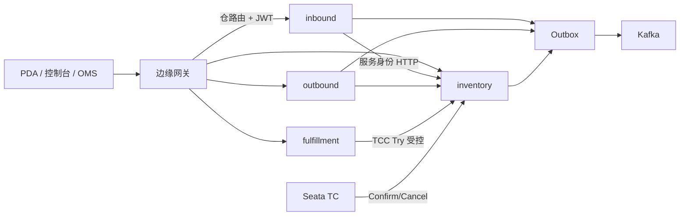

# 边缘网关与弹性演进

## 1. 状态与边界

本文记录后续若接入**南北向网关、超时、重试、熔断、统一入口鉴权**时，如何叠在既有三服务协议上，而不是改写库存权威或引入 Spring Cloud 作为业务运行时。

| 项 | 状态 |
| --- | --- |
| 文档授权 | 用户要求先记入设计文档 |
| 本轮实施 | **未批准、未排入 S0–S9 必选切片** |
| 产品批准 | 本版建议；不等于已批准建设网关或网格 |
| 与现网关系 | 不改变独立 inbound/outbound/inventory、Seata TCC、本地事务+Kafka Outbox、OIDC 资源服务器 |

首期仍按[总体架构](01-architecture.md)使用环境配置与部署平台 DNS。Nacos / Spring Cloud BOM 不是本演进的前提。文中的「网关」指南北向边缘进程或平台 Ingress，**不是** S0 的 `HttpGatewayTryProbe`（该探针代表已确认 TM=`wms-fulfillment` 的受控 HTTP Try 入口，正式模块仍是 S4）。

未完成本文落地前，S1 仍按计划在各业务服务接入 OIDC；缺少服务端鉴权与幂等键时，不得把网关自动重试或超时当成安全语义。

## 2. 目标与非目标

目标：在不移动库存/单据权威的前提下，为 PDA、控制台、OMS 提供统一 TLS/认证入口和仓路由；为东西向 HTTP 提供**按操作类**的超时、有界重试和熔断。

非目标：

- 把三服务改成 Spring Cloud 应用，或用 OpenFeign 默认重试替代幂等协议
- 网关成为第二套 TM，或把 XID 当作认证凭据
- 用熔断 fallback 返回「库存充足」或空列表冒充成功
- Kafka / Outbox / XXL / Seata TC 回调走 HTTP 网关
- 拆除各服务 OIDC 资源服务器，改信网关转发的 `X-User-Id`

## 3. 流量平面

| 平面 | 是否经边缘网关 | 超时 / 重试 / 熔断 |
| --- | --- | --- |
| 南北向：`/api/wms/v1` | 是 | 入口策略；**写操作默认不自动重试** |
| 东西向：来源服务 → inventory | 否，Cell 内直连 | 进程内客户端库按操作类配置 |
| Seata TCC / TC 二阶段回调 | 否 | 禁止应用层重试 Try；Confirm/Cancel 仅 RM 框架 |
| Kafka / Outbox / XXL | 否 | 沿用投递、inbox 与任务恢复，不套 HTTP 熔断 |

公开路径路由仍按[API 契约](04-contracts.md)第 2 节：receipts/quality/putaways→inbound，picks/packings/shipments→outbound，reservations/库存门禁→inventory，fulfillments/transfers→fulfillment。客户端不得指定数据源。

## 4. 备选与推荐

| 方案 | 形态 | 为何不作为默认 |
| --- | --- | --- |
| **A. 边缘网关 + 分类弹性库（推荐）** | Envoy / Kubernetes Gateway API，或单独 Gateway 进程；东西向 Resilience4j（或等价） | — |
| B. 整包 Spring Cloud | Gateway + OpenFeign + 全服务 Cloud BOM | Boot 4.1 兼容矩阵重开；Feign 默认重试易撞 TCC 与同键协议 |
| C. 全网格 | Istio/Linkerd 覆盖所有 HTTP | 运维与本地探针成本高；网格重试同样必须排除 Try 与非幂等写 |

推荐 A：网关只是一个部署单元，业务服务仍是独立 Spring Boot 进程。实例数与 mTLS 运维成为瓶颈时，再评估网格，且重试白名单必须排除 TCC Try 和所有非幂等写。

## 5. 三层职责

**边缘网关（入口，不持有库存权威）**

- TLS、请求体大小、按仓/租户限流、按资源前缀路由到对应服务。
- 校验 JWT，拒绝未认证请求。剥离客户端自带的 `X-User` / `X-Enterprise` 等身份头；只转发已验证的 `Authorization`、`Idempotency-Key`、`X-Request-Id`、`If-Match`。
- 按控制平面版本化目录做 `warehouseId → Cell` 路由，并带当前 `routeEpoch`。服务端仍校验 epoch；过期返回 409 `ROUTE_EPOCH_STALE`，见契约第 4 节。
- 写接口超时返回 504/未知，**不改写业务失败码**。调用方用原幂等键查询 `/operations/{id}`。
- 熔断打开只返回 503 `DEPENDENCY_UNAVAILABLE`，禁止库存空结果兜底。

**业务服务（授权与正确性）**

- 各服务保持 OIDC 资源服务器。绕过网关直连时仍须 401。仓权限、`sourceService` 凭据、幂等、门禁在服务内执行。请求中的 enterprise 字段只做一致性核验，不能扩大权限。
- 东西向使用服务账号（mTLS 或服务 token），不得用操作员 JWT 冒充 inbound/outbound 身份。
- fulfillment → inventory 的 Try 继续只接受已确认 TM 身份（当前探针为 `X-Wms-Tm=wms-fulfillment`）。用户 token 不能换 Confirm/Cancel。

**东西向 HTTP 客户端（分类弹性）**

每个下游调用标注操作类，禁止全局 `retry: 3`。库存库不可用时拒绝新库存授权，入出库可停在观察/`stockSyncStatus=PENDING`，与[总体架构](01-architecture.md)故障策略一致。readiness 须反映数据库与分片可用性，不能只用进程 UP 表示库存可写。

## 6. 操作类策略

| 操作类 | 超时 | 重试 | 熔断打开 |
| --- | --- | --- | --- |
| GET 状态 / stock-command 查询 | 短 | 有界、抖动 | 503，调用方查本地 operation |
| 已带固定 `commandId` 的内部 POST | 中 | 仅同键；超时先 GET 再决定 | 拒绝新授权，来源保持 PENDING |
| 公开写（收货/拣货等，已 202） | 略高于对应 SLO | **调用方同键重试，网关与中间件不重试** | 429/503 + `Retry-After` |
| TCC Try | 单独预算 | **禁止**；丢响应则查 attempt/TC，不能恢复则受控回滚 | 按仓/Cell 隔离 |
| Confirm/Cancel | Seata | 仅 TC 驱动 | 不得熔成「空回滚成功」 |

依据：[幂等协议](10-idempotency-protocols.md)禁止首次 Try 响应丢失后的应用层/RPC 盲目重试；[契约](04-contracts.md)规定网络超时没有 HTTP 业务结论，禁止 UI 换新幂等键；Seata 2.6 同身份再次 `prepareFence` 会 DuplicateKey 并可能清理 Tried 记录，S0 探针已禁止活动分支上重放 Try。

`retryable` 响应字段与 HTTP 状态由业务服务给出。网关不得把 409 业务冲突改成可重试 503，也不得把 202 受理当成 200 成功后再次 POST。

## 7. 统一入口鉴权

统一的是**入口认证**，不是把授权外移。

| 层 | 负责 | 不负责 |
| --- | --- | --- |
| 网关 | token 是否有效、粗限流、仓→Cell 路由 | 仓动作授权、sourceService、幂等冲突、TCC 所有权 |
| 业务服务 | 仓范围、动作权限、服务身份、effect/command 去重 | 替代 IdP 签发 token |
| TM/RM | Try 入口与二阶段回调身份 | 把用户 JWT 当作 XID |

内部跨服务调用也须认证，见契约第 1 节。网关验过就信任 `X-User-Id` 的模型禁止采用。

## 8. 落地顺序（仅当后续单独批准实施）

1. **先完成 S1 OIDC、Idempotency-Key、202/statusUrl。** 无这三项则网关重试与超时没有安全语义。
2. 只为南北向加边缘：TLS、JWT、路径路由、限流；写路径关闭自动重试。
3. 东西向引入小的 HTTP 客户端封装（不必新业务模块）：超时、同键重试、按仓熔断；inventory readiness 绑定数据库。
4. 网关接入版本化仓→Cell 表；服务继续拒绝旧 `routeEpoch`。
5. 实例数与服务间 mTLS 成为运维瓶颈时再评估网格；重试白名单排除 TCC Try 与非幂等写。

产品选型（Envoy vs 独立 Spring Cloud Gateway **进程** vs 平台 Ingress）在实施立项时锁定兼容矩阵，不在本文指定厂商。若选用 Spring Cloud Gateway，仅作为边缘部署单元，不把 Cloud BOM 扩散到 inbound/outbound/inventory。

## 9. 明确禁止

- 网关或 Feign 对 TCC Try 自动重试；Confirm/Cancel 对普通调用者开放
- 熔断 fallback 编造库存或单据成功
- 超时后由中间件生成新 `clientOperationId` / `commandId` / `allocationAttemptId`
- 配置中心与环境变量对同一键优先级不明；动态刷新不得在一轮分配中改 SKU 策略或路由 epoch，见[容量与运维](06-capacity-operations.md)
- 把本文当作 S0 完成或网关已交付的证据
