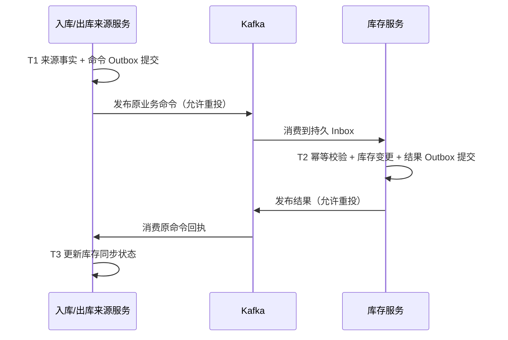

# 数据与接口索引

核对基线 `1dd3d18`（2026-09-13，序列拣发切片与 main 文档整合）。本文定位实际源码和迁移，不复制一套容易漂移的完整字段字典。业务规则见[领域设计](../design/02-domain.md)，当前整改边界见[交付状态](../delivery/wms-v1/DELIVERY_STATUS.md)。

## 数据所有权与迁移

| 权威模块 | 负责的数据 | Compose schema | 迁移目录 / 当前最高版本 |
| --- | --- | --- | --- |
| inbound | 入库单、分批收货观察、质检、上架、来源命令及回执 | `wms_inbound` | [inbound 迁移](../../wms-inbound/src/main/resources/db/migration)；V017 `source_reconciliation_window` |
| outbound | 出库单、拣发任务、实物执行、取消、履约授权快照 | `wms_outbound` | [outbound 迁移](../../wms-outbound/src/main/resources/db/migration)；V019 `source_reconciliation_window` |
| inventory | 主数据、库存余额/流水、预占与执行资格、盘点、仓路由、序列号本地事实、查询投影 | `wms_inventory`，按 Cell 隔离 | [inventory 迁移](../../wms-inventory/src/main/resources/db/migration)；V042 `serial_shipment_intent` |
| serial-registry | 企业 + SKU + SN 身份、归属和转移凭据 | `wms_registry` | [registry 迁移](../../wms-serial-registry/src/main/resources/db/migration/registry)；V005 `serial_shipment` |
| fulfillment | 跨仓计划、attempt/XID 绑定、参与者与自动执行恢复、授权 Outbox | `wms_fulfillment` | [fulfillment 迁移](../../wms-fulfillment/src/main/resources/db/migration/fulfillment)；V019 `empty_launch_terminal_evidence` |

版本号是本次代码快照，不代表现场数据库已执行到该版本。跨服务通过契约协作，不共享事务管理器或直接写对方表。当前独立查询服务尚未创建，投影在 inventory 内；`wms-integration` 是适配库，没有独立 schema 或启动进程。

新增表和字段必须写中文含义注释；通过追加迁移演进，不修改已执行文件伪造历史。唯一约束、条件更新、影响行数和事务边界共同维护完整性。变更前检查新旧应用共存、回填和回退条件；代码回退不自动撤销已提交业务数据。

仓迁移显式复制 54 张企业/仓范围表，列表由[WarehouseMigrationStore](../../wms-inventory/src/main/java/com/lrj/wms/inventory/migrate/infrastructure/WarehouseMigrationStore.java)维护；仓路由、共享目录、数据库时间策略和 TC Fence 有独立限制，不能推断整库均可迁移。详细见[迁移边界](WAREHOUSE_MIGRATION_LIMITS.md)。

## HTTP 与鉴权

- [OpenAPI](../../wms-contract/src/main/resources/openapi/wms-v1.yaml)：本基线 93 个 path、106 个 operation，包含请求/响应、错误和 scope 声明；统计不代表对应场景全部验收。
- [权限映射](../../wms-security/src/main/resources/wms-operation-scopes.tsv)：服务端按操作校验 scope、企业及仓授权。序列号登记另外校验受信服务主体；内部 TCC 路径仍有专门的隔离与身份要求。
- [契约生成器](../../scripts/generate-openapi.py)与[契约校验](../../scripts/verify-contracts.sh)：修改 API 时同步生成器、OpenAPI、权限与真实 HTTP 测试，不能只改页面权限显示。
- 写命令按接口要求传 `Idempotency-Key`，重试保持原业务身份和正文；HTTP 202 表示受理或处理中，不代表库存过账、TC 全局成功或实物完成。
- 数量必须携带单位/精度语义，时间使用明确 UTC/偏移规则。跨 JVM 与历史数据库的边界以[数据库时间](DATABASE_TIME.md)为准。

前端代理路径见[连接清单](../operations/INFRASTRUCTURE.md)。业务路径认证默认拒绝；liveness、readiness 和业务成功是三种不同证据。

来源关窗证明提供端已增加内部受信入口，默认关闭；全部旧来源写节点退出后才可启用。来源窗口COMPLETE不代表库存核验或快照完整，库存采集尚在实施，见[可信水位](RECONCILIATION_WATERMARK.md)。

## 事件、一致性与恢复

这是跨库最终收敛协议，不是一个横跨数据库的本地事务。消息提交、Broker 确认与业务落库有不同失败窗口，须依靠 Inbox、Outbox、原业务身份与持久恢复处理重复、断连和回执丢失。具体字段/版本见[消息运行](MESSAGING_RUNTIME.md)、[出库消息](OUTBOUND_MESSAGING.md)；多 Cell Topic 与消费者路由见[多 Cell 消息](INVENTORY_CELL_MESSAGING.md)，前缀来自 `WMS_MESSAGING_TOPIC_PREFIX`。

跨仓预占由 fulfillment 作为 TM 发起，TC 持有全局决定，inventory 作为 RM 维护本仓资源。只有原 TC 可靠终态与全部原分支确认满足屏障后才发送出库执行授权。SDK 返回、HTTP 超时和本地 `CONFIRMED` 文本都不能独立证明全局成功。Try 字段见[仓级契约](../../wms-contract/src/main/resources/contracts/warehouse-tcc-try-v1.schema.json)，实现入口见[自动履约](FULFILLMENT_EXECUTION.md)。

序列号收货、质检、上架、源释放、逐身份盘点及PICK/分次SHIP已有持久恢复；发运全球确认与库存POSTED分开，详见[序列出库](SERIAL_OUTBOUND_DESIGN.md)。仍缺公开序列调拨接入、可信对账水位及TC迁移/晚取消补偿。不得用普通数量链路测试代替逐SN归属和epoch验证。归档当前仅生成候选计划，保留期限、删除与导出不由本文件补造。

## 验证入口

数据库语义由真实 MySQL 集成测试验证，单纯 Mock 不证明事务或并发正确。默认必需 IT 名单在[required-its-default.txt](../../scripts/required-its-default.txt)（本基线 117 项）；构建/profile/smoke 的准确命令见[运行与验证](S0_RUNBOOK.md)。既有结果见[阶段组合证据](REMEDIATION_VERIFICATION_2026-09-13.md)，其提交和范围必须一起阅读，不能把旧计数当成当前代码重测结果。
